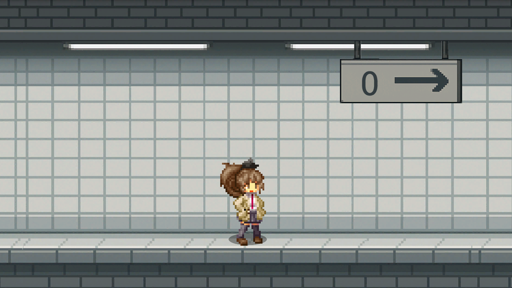
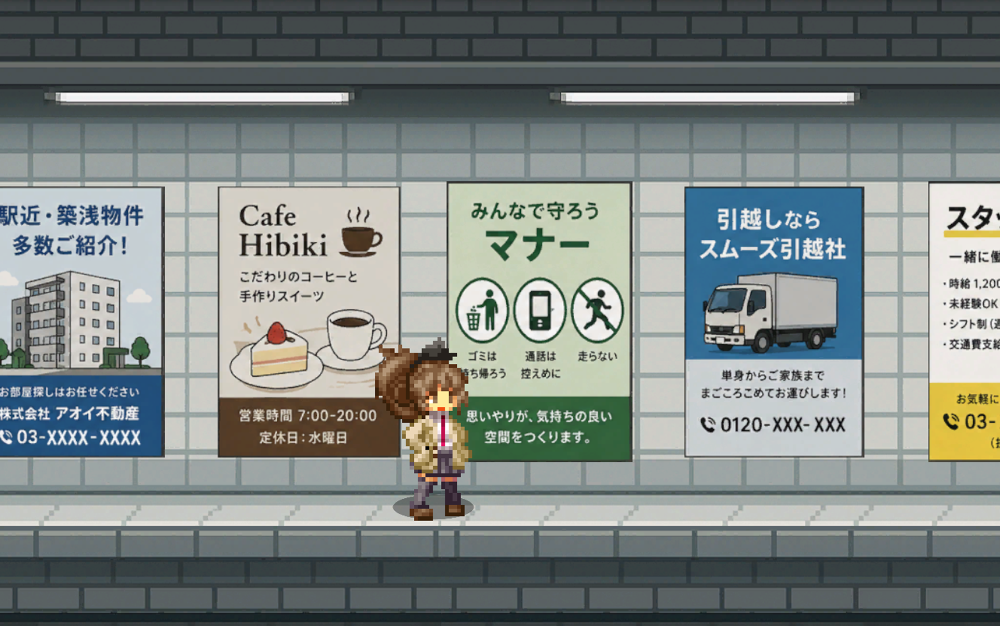
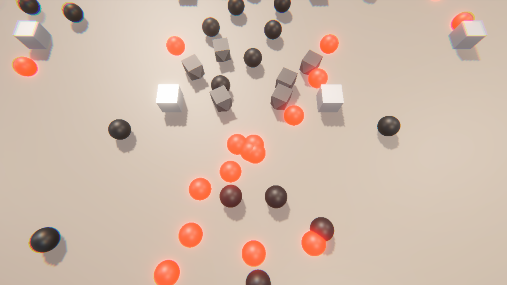

# ゲームタイトル

## 🟦 概要
このゲームは〇〇をテーマにしたアクションゲームです。

---

## 🟦 制作情報
- 制作期間：〇〇年〇月〜〇〇年〇月（約〇ヶ月）
- 使用言語：C# / C++ など
- 使用エンジン：Unity など

---

## 🟦 ゲーム内容
- プレイヤーは〇〇を操作します
- 〇〇を見つけながらゴールを目指します
- ステージは全〇面あります

---

## 💡 工夫した点

本プロジェクトでは以下の点を工夫して設計・実装を行いました。

- 〇〇の処理を最適化し、動作負荷を軽減した
- UIを見やすく設計し、ユーザーの操作性を向上させた
- 難易度調整機能を実装し、プレイヤーのスキルに応じたゲームバランスを実現した

また、オブジェクト指向設計を採用し、各ゲーム要素をクラス単位で責務分割しました。  
共通機能は基底クラスに集約することで、コードの再利用性と拡張性を高めています。  
さらに、イベント駆動による疎結合設計を意識し、クラス間の依存関係を最小限に抑えました。

---

## 📷 スクリーンショット

---

## ⬜ 今後の予定
- ステージ追加
- サウンド改善
- バグ修正
